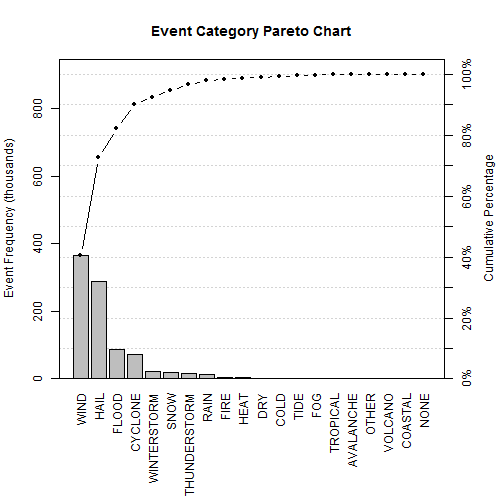
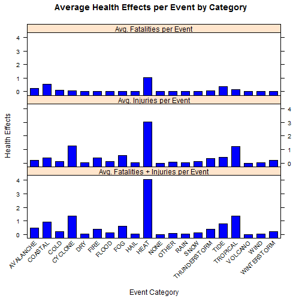
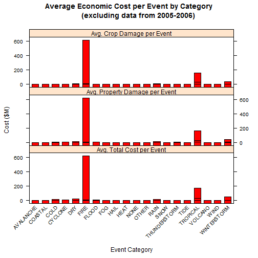

### Synopsis

The goal of this report is the determination of which type(s) of severe weather
event have the greatest cost, both to population health and economically, in the
United States.  The data used in this analysis were gathered by the [National Oceanic and Atmospheric Administration](http://www.noaa.gov/) 
of the U.S. government between 1950 and 2011.  Population health effects were
examined in terms of injuries, fatalities, and the sum of these.  Economic 
costs, excluding any inflation-related effects, were examined based on property
damage, damage to crops, and total cost (sum of property and crop damages). 
From the data, it was determined that while cyclone events (excluding 
hurricanes/typhoons) occurred the most frequently, the events that caused the 
most health-related damage per on average were heat-related (i.e., extreme high 
temperatures) and those that caused the most economic damage on average were
tropical-related storms (including hurricanes, typhoons, tropical storms, and 
tropical depressions). Given the large economic impact of Hurricane Katrina (and 
the flooding it caused) in 2005 and into 2006, it was further determined that 
the most costly type of event (excluding those years) was fire.

### Data Processing

#### Functions

Prior to reading and processing the data, certain R packages are loaded into
memory to facilitate the analysis.  The [`pkgInst`](https://github.com/scumdogsteev/R-functions-and-such/blob/master/pkgInst.R) function below (originally from
[this Stack Overflow response](http://stackoverflow.com/questions/4090169/elegant-way-to-check-for-missing-packages-and-install-them/))
is used to load (or install, if necessary) a set of packages.


```r
## "pkgInst" is a function that checks whether a set of packages are loaded or
## installed and, if not, installs and loads them.  x is a set of packages.
pkgInst <- function(x) {
    for (i in x) {
        ## "require" returns TRUE invisibly if it was able to load package
        if (!require(i, character.only = TRUE)) {
            ## if package was not able to be loaded, install it
            install.packages(i, dependencies = TRUE)
            ## load package after installing
            require (i, character.only = TRUE)
        }
    }
}
```

The following function, `printCurrency` (from [this Stack Overflow response](http://stackoverflow.com/a/23833928)), 
properly displays currency in the results below.


```r
printCurrency <- function(value, currency.sym = "$", digits = 2, sep = ",",
                          decimal=".") {
  paste(
        currency.sym,
        formatC(value, format = "f", big.mark = sep, digits = digits, 
                decimal.mark=decimal), sep=""
  )
}
```

#### Packages

The packages chosen to facilitate this analysis are:

* [dplyr](http://cran.rstudio.com/web/packages/dplyr/)
* [lattice](http://cran.r-project.org/web/packages/lattice/index.html)
* [lubridate](http://cran.r-project.org/web/packages/lubridate/index.html)
* [qcc](http://cran.r-project.org/web/packages/qcc/index.html)
* [reshape2](http://cran.r-project.org/web/packages/reshape2/index.html)


```r
## run pkgInst for the set of packages
pkgInst(c("dplyr", "lattice", "lubridate", "qcc", "reshape2"))
```

```
## Loading required package: dplyr
## 
## Attaching package: 'dplyr'
## 
## The following object is masked from 'package:stats':
## 
##     filter
## 
## The following objects are masked from 'package:base':
## 
##     intersect, setdiff, setequal, union
## 
## Loading required package: lattice
## Loading required package: lubridate
## Loading required package: qcc
## Package 'qcc', version 2.6
## Type 'citation("qcc")' for citing this R package in publications.
## Loading required package: reshape2
```

#### Data background

From the assignment:

> The data for this assignment come in the form of a comma-separated-value
> file compressed via the bzip2 algorithm to reduce its size. You can download
> the file from the course web site:
> 
> * [Storm Data](https://d396qusza40orc.cloudfront.net/repdata%2Fdata%2FStormData.csv.bz2) [47Mb]
>
> There is also some documentation of the database available. Here you will 
> find how some of the variables are constructed/defined.
>
> * National Weather Service [Storm Data Documentation](https://d396qusza40orc.cloudfront.net/repdata%2Fpeer2_doc%2Fpd01016005curr.pdf)
> * National Climatic Data Center Storm Events [FAQ](https://d396qusza40orc.cloudfront.net/repdata%2Fpeer2_doc%2FNCDC%20Storm%20Events-FAQ%20Page.pdf)
>
> The events in the database start in the year 1950 and end in November 2011.
> In the earlier years of the database there are generally fewer events
> recorded, most likely due to a lack of good records. More recent years
> should be considered more complete.

### Reading the data

The analysis begins with the assumption that the data file
("repdata-data-StormData.csv.bz2") exists in the working directory.  The data
is read into a data frame called "NOAAdata" using R's "read.csv" function.  
Though the file is compressed (using the bzip2 compression algorithm), this
function is capable of reading it directly.

Reading in the data has been cached to facilitate re-running the analysis.


```r
## read the data to a data frame called "NOAAdata" settings "stringsAsFactors"
## to FALSE to ensure that read.csv will read strings as strings
NOAAdata <- read.csv("repdata-data-StormData.csv.bz2", 
                     stringsAsFactors = FALSE)
```

#### Processing the data

After reading in the data, the dimensions of the NOAAdata data frame are
determined and the first few rows are checked.


```r
dim(NOAAdata)
```

```
## [1] 902297     37
```

```r
head(NOAAdata)
```

```
##   STATE__           BGN_DATE BGN_TIME TIME_ZONE COUNTY COUNTYNAME STATE
## 1       1  4/18/1950 0:00:00     0130       CST     97     MOBILE    AL
## 2       1  4/18/1950 0:00:00     0145       CST      3    BALDWIN    AL
## 3       1  2/20/1951 0:00:00     1600       CST     57    FAYETTE    AL
## 4       1   6/8/1951 0:00:00     0900       CST     89    MADISON    AL
## 5       1 11/15/1951 0:00:00     1500       CST     43    CULLMAN    AL
## 6       1 11/15/1951 0:00:00     2000       CST     77 LAUDERDALE    AL
##    EVTYPE BGN_RANGE BGN_AZI BGN_LOCATI END_DATE END_TIME COUNTY_END
## 1 TORNADO         0                                               0
## 2 TORNADO         0                                               0
## 3 TORNADO         0                                               0
## 4 TORNADO         0                                               0
## 5 TORNADO         0                                               0
## 6 TORNADO         0                                               0
##   COUNTYENDN END_RANGE END_AZI END_LOCATI LENGTH WIDTH F MAG FATALITIES
## 1         NA         0                      14.0   100 3   0          0
## 2         NA         0                       2.0   150 2   0          0
## 3         NA         0                       0.1   123 2   0          0
## 4         NA         0                       0.0   100 2   0          0
## 5         NA         0                       0.0   150 2   0          0
## 6         NA         0                       1.5   177 2   0          0
##   INJURIES PROPDMG PROPDMGEXP CROPDMG CROPDMGEXP WFO STATEOFFIC ZONENAMES
## 1       15    25.0          K       0                                    
## 2        0     2.5          K       0                                    
## 3        2    25.0          K       0                                    
## 4        2     2.5          K       0                                    
## 5        2     2.5          K       0                                    
## 6        6     2.5          K       0                                    
##   LATITUDE LONGITUDE LATITUDE_E LONGITUDE_ REMARKS REFNUM
## 1     3040      8812       3051       8806              1
## 2     3042      8755          0          0              2
## 3     3340      8742          0          0              3
## 4     3458      8626          0          0              4
## 5     3412      8642          0          0              5
## 6     3450      8748          0          0              6
```

Based on the data types in each of the columns, the columns that are of interest
for the remainder of the analysis are:

* `BGN_DATE`, the date of the beginning of the event
* `EVTYPE`, the type of event
* `FATALITIES`, the number of fatalities from an event
* `INJURIES`, the number of injuries from an event
* `PROPDMG` and `PROPDMGEXP`, the financial impact to property and its 
multiplier  (e.g., hundreds, thousands, or millions of dollars)
* `CROPDMG` and `CROPDMGEXP`, the financial impact to crops and its multiplier
(e.g., hundreds, thousands, or millions of dollars)

As these are the relevant columns, a new (subset) data frame (`NOAAdatasub`) is 
created consisting of only these seven columns.  `EVTYPE` is converted to 
an uppercase factor column to facilitate matching.  Additionally, rows
containing the words "summary" and "monthly" are removed as these are daily and 
monthly summaries of event data.


```r
## subset the NOAAdata dataframe to the relevant columns as described above
NOAAdatasub <- NOAAdata[,grepl("BGN_D|EVTYPE|FATALITIES|INJURIES|PROPDMG|CROPDMG",
                               names(NOAAdata))]

## using the lubridate package's mdy_hms function, convert the BGN_DATE column
## to the year of the event and store the result in a new column called YEAR
NOAAdatasub$YEAR <- year(mdy_hms(NOAAdatasub$BGN_D))

## remove the BGN_DATE column by setting it to NULL
NOAAdatasub$BGN_DATE <- NULL

## convert the EVTYPE field to uppercase factors to facilitate summarization.
## using uppercase ensures that entries such as "wind" and "WIND" are regarded
## as the same event type
NOAAdatasub$EVTYPE <- as.factor(toupper(NOAAdatasub$EVTYPE))

## remove rows from events containing the word "SUMMARY" and "MONTHLY" as these
## are daily and monthly summaries, respectively
NOAAdatasub <- NOAAdatasub[!grepl('SUMMARY|MONTHLY', NOAAdatasub$EVTYPE),]
```

Next, the dollar damages to property and crops are determined.  First, the 
multipliers (`PROPDMGEXP` and `CROPDMGEXP`) must be evaluated.


```r
## display the summaries of PROPDMGEXP and CROPDMGEXP to indicate their
## structures
summary(as.factor(NOAAdatasub$PROPDMGEXP))
```

```
##             -      ?      +      0      1      2      3      4      5 
## 465803      1      8      5    216     25     13      4      4     28 
##      6      7      8      B      h      H      K      m      M 
##      4      5      1     40      1      6 424665      7  11330
```

```r
summary(as.factor(NOAAdatasub$CROPDMGEXP))
```

```
##             ?      0      2      B      k      K      m      M 
## 618282      7     19      1      9     21 281832      1   1994
```

As these columns contain inconsistent data (some are numeric, some are 
alphabetic, and some are non-alphanumeric), they must be transformed in order to
be of use.  The following assumptions were used in the transformations of 
`PROPDMGEXP` and `CROPDMGEXP`:

* numeric values are powers of 10 (e.g., 1 = 10^1 = 10, 2 = 10^2 = 100, etc.)
* letters indicate the first letter of the multiplier (i.e., h or H = hundred, 
k or K = thousand, m or M = million, b or B = billion)
* non-alphanumeric values are unity (e.g., if `PROPDMG` = 20 and `PROPDMGEXP` 
= "+", it is assumed that the damage is $20 = 20 * 1)


```r
## per the above, determine the multiplier for property damage expenses
NOAAdatasub$PROPDMGMULT <- if (is.numeric(NOAAdatasub$PROPDMGEXP)) {
    NOAAdatasub$PROPDMGMULT <- 10^as.integer(NOAAdatasub$PROPDMGEXP) } else {
## grepl is used to match lowercase and capital versions of the following
## letters:  h (hundreds), k (thousands), m (millions), and b (billions)         
        ifelse(grepl("[hH]", NOAAdatasub$PROPDMGEXP), 10^2,
               ifelse(grepl("[kK]", NOAAdatasub$PROPDMGEXP), 10^3, 
                      ifelse(grepl("[mM]", NOAAdatasub$PROPDMGEXP), 10^6,
                             ifelse(grepl("[bB]", NOAAdatasub$PROPDMGEXP), 10^9,
                                    1))))
    }

## per the above, multiplier the units for crop damage expenses in the same
## fashion as was used for property damage expenses
NOAAdatasub$CROPDMGMULT <- if (is.numeric(NOAAdatasub$CROPDMGEXP)) {
    NOAAdatasub$CROPDMGMULT <- 10^as.integer(NOAAdatasub$CROPDMGEXP) } else {
        ifelse(grepl("[hH]", NOAAdatasub$CROPDMGEXP), 10^2,
               ifelse(grepl("[kK]", NOAAdatasub$CROPDMGEXP), 10^3, 
                      ifelse(grepl("[mM]", NOAAdatasub$CROPDMGEXP), 10^6,
                             ifelse(grepl("[bB]", NOAAdatasub$CROPDMGEXP), 10^9,
                                    1))))
    }
```

Total property and crop damages are then determined by taking the product of the
`*DMG` and `*DMGMULT` columns (e.g., `PROPDMG` * `PROPDMGMULT`).


```r
## determine the total property and crop damage by multiplying the damage dollar
## amounts by their respective multipliers
NOAAdatasub$PROPDAMAGE <- NOAAdatasub$PROPDMG * NOAAdatasub$PROPDMGMULT
NOAAdatasub$CROPDAMAGE <- NOAAdatasub$CROPDMG * NOAAdatasub$CROPDMGMULT
```

Total damages (the sum of property and crop damages) are then determined and
added to the data frame (as column `TOTALDAMAGE`) along with the total health
effects (`TOTALHEALTH`) before cleaning up the data frame by removing columns
that are no longer needed.


```r
## the expenses for total damages (property + crop) are determined and added as
## a column called TOTALDAMAGE
NOAAdatasub$TOTALDAMAGE <- NOAAdatasub$PROPDAMAGE + NOAAdatasub$CROPDAMAGE

## similarly, add a column called TOTALHEALTH which sums fatalities and injuries
NOAAdatasub$TOTALHEALTH <- NOAAdatasub$FATALITIES + NOAAdatasub$INJURIES

## remove columns no longer needed for the analysis
NOAAdatasub <- NOAAdatasub[,grepl('YEAR|EVTYPE|FATAL|INJ|PROPDA|CROPDA|TOTAL', 
                                   names(NOAAdatasub))]
```

This leaves 8 columns: EVTYPE, FATALITIES, INJURIES, YEAR, PROPDAMAGE, CROPDAMAGE, TOTALDAMAGE, TOTALHEALTH.


```r
## create a data frame consisting of a factor variable containing the unique
## event types from the EVTYPE column
events <- data.frame(EVTYPE = as.factor(unique(NOAAdatasub$EVTYPE)))

## determine the number of rows in the events data frame
nrow(events)
```

```
## [1] 827
```

There are 827 unique events in the "events" data frame. 
However, per the "Storm Data Event Table" (Table 2.1.1) of the [Storm Data
Documentation](https://d396qusza40orc.cloudfront.net/repdata%2Fpeer2_doc%2Fpd01016005curr.pdf),
the NOAA recognizes 48 distinct event types.  

These 48 event types are further grouped into the following 20 categories 
(combining things like snow and blizzard, most types of wind, etc.) which were 
chosen based on the assumption that they are reasonable groupings of event
types. There are still some overlaps between the categories (e.g., 
thunderstorm-related winds are categorized as wind and lightning-related fires 
are grouped with other fires) but it is believed that they are sufficiently
aggregated for this analysis. Additionally, hurricane-related effects show up 
in the `TROPICAL` and `FLOOD` categories.  The `EVTYPE` column is 
categorized using a series of regular expression matches.

Event categories:

1. `AVALANCHE` (includes debris flow, landslide, and [landslump](http://en.wikipedia.org/wiki/Slump_%28geology%29))
2. `COASTAL` (includes marine accidents/mishaps and drowning as well as
non-specific coastal events; specific coastal activities (e.g., hail, wind) are
captured in their respective categories)
3. `COLD` (includes wind chill, frost/freeze, hypothermia, and "snow and cold")
4. `CYCLONE` (includes all types of cyclones and related events except 
hurricanes/typhoons (i.e., tornado, dust devil, [water](http://en.wikipedia.org/wiki/Waterspout)/[landspout](http://en.wikipedia.org/wiki/Landspout), and
funnel/wall cloud))
5. `DRY` (includes drought and below normal precipitation)
6. `FIRE` (includes smoke, lightning-related fires, and [red flag criteria](http://www.srh.noaa.gov/tae/?n=redflag))
7. `FLOOD` (all types of flooding regardless of location, also includes "rapidly
rising water," dam failures, and urban stream-related events but excludes storm 
surge and swells captured in the `TROPICAL` category)
8. `FOG` (regardless of type, freezing or dense)
9. `HAIL` (all types regardless of geography)
10. `HEAT` (includes record temperatures and hyperthermia)
11. `RAIN` (includes mixed precipitation)
12. `SNOW` (includes blizzards)
13. `THUNDERSTORM` (includes lightning but excludes lightning-related fires and
thunderstorm-related wind)
14. `TIDE` (includes all waves (i.e., tsunami, [seiche](http://en.wikipedia.org/wiki/Seiche), 
high surf, rip current) as well as high seas)
15. `TROPICAL` (includes hurricanes/typhoons, tropical storms, tropical
depressions, and all named storms)
16. `VOLCANO` (includes eruptions and volcanic ash)
17. `WIND` (includes all types of wind and related events (such as dust storms)
except those included in the `CYCLONE` and `TROPICAL` but excludes `WIND CHILL`
which is categorized as `COLD`-related)
18. `WINTERSTORM` (includes winter weather, winter storms, and ice 
storms/sleet/glaze)
19. `OTHER` (events that don't fit into the other categories)
20. `NONE` (events where no severe weather was recorded)


```r
## determine event categories as described above. this is not the most elegant
## solution but it works.
events$eventCat <- as.factor(
## grouping all remaining types of wind
ifelse(grepl("W[ I]*ND|WINS|BURST|DUST|TURB", events$EVTYPE), "WIND",
## grouping all downhill movements of land/rock into a category called AVALANCHE
     ifelse(grepl("AVALANCHE|DEBRIS FLOW|SLIDE|AVALANCE|LANDSLUMP",
                                  events$EVTYPE), "AVALANCHE",
## grouping beach/coastal erosion, marine mishaps/accients, and drownings            
ifelse(grepl("BEACH E[ROSI]*N|COASTAL[ ]*[STORM|ERO]|MARINE MISHAP|MARINE ACCIDENT|DROWN", events$EVTYPE), "COASTAL",
## grouping all funnel/wall clouds and related events with the exception of
## hurricanes/typhoons
ifelse(grepl("NADO|DUST DEV|SPOUT|FUNNEL|TORNDAO|WALL|WHIRLWIND",
             events$EVTYPE), "CYCLONE",
## grouping all cold/low-temperature events
ifelse(grepl("COLD|CHILL|FREEZE|COOL|RECORD LOW*|FROST|LOW TEMP|HYPOTHERMIA", 
             events$EVTYPE), "COLD",
## grouping all dry/drought/low precipitation events       
ifelse(grepl("DROUGHT|DRY|BELOW NORMAL PRECIP|DRI", events$EVTYPE), "DRY",
## grouping all fire and smoke-related events
ifelse(grepl("FIRE|SMOKE|RED FLAG CRITERIA", events$EVTYPE), "FIRE",
## grouping all flooding, including dam breaks
ifelse(grepl("FL[O]*D|DAM [FB]|RAPIDLY RISING WATER|STREAM|URBAN", 
             events$EVTYPE), "FLOOD",
## grouping all types of fog
ifelse(grepl("[FV]OG", events$EVTYPE), "FOG",
## grouping all types of hail
ifelse(grepl("HAIL", events$EVTYPE), "HAIL",
## grouping thunderstorms and lightning       
ifelse(grepl("T[H]*U[NDERSTOR|NDERSTRO]*M|LIG[HN]T[N]*ING|TSTM", events$EVTYPE),
       "THUNDERSTORM",
## grouping all types of heat/high temperatures
ifelse(grepl("HEAT|WARM|HIGH TEMP|RECORD TEMP|TEMPERATURE RECORD|HOT|HYPERTHERMIA|RECORD HIGH", 
             events$EVTYPE), "HEAT",
## grouping all types of rain and non-specific precipitation
ifelse(grepl("RAIN|SHOWER|MIXED PRECIP|WET|NORMAL PRECIP|HEAVY PRECIP|EXCESSIVE PRECIP|RECORD PRECIP",
             events$EVTYPE), "RAIN",
## grouping all types of snow
ifelse(grepl("SNOW|BLIZZARD", events$EVTYPE), "SNOW",
## grouping non-snow winter weather
ifelse(grepl("WINT|ICE|SLEET|GLAZE|FREEZING|ICY", events$EVTYPE), "WINTERSTORM",
## grouping hurricanes, tropical storms, tropical depressions and their effects
## such as storm surge
ifelse(grepl("HURRICANE|TROPICAL|TYPHOON|FLOYD|SURGE", events$EVTYPE), "TROPICAL",
## grouping all wave/tide-related events
ifelse(grepl("TIDE|SURF|CURRENT|SEICHE|TSUNAMI|SEAS|SURGE|SEAS|HIGH WATER|SWELLS|SEAS|WAVE",
             events$EVTYPE), "TIDE",
## grouping all volcanic events
ifelse(grepl("VOLCAN", events$EVTYPE), "VOLCANO",
## grouping all events with no severe weather identified
ifelse(grepl("NONE|NO SEVERE", events$EVTYPE), "NONE",
## grouping remaining events
       "OTHER")))))))))))))))))))
)
```

Once events are categorized, there are 20 categories instead of the 
827 unique event types in the original data set.  The distribution
of the unique event types into these 20 categories is as follows:


```r
summary(events$eventCat)
```

```
##    AVALANCHE      COASTAL         COLD      CYCLONE          DRY 
##           19           10           50           38           31 
##         FIRE        FLOOD          FOG         HAIL         HEAT 
##           14           98            6           32           34 
##         NONE        OTHER         RAIN         SNOW THUNDERSTORM 
##            2           10           64           77           23 
##         TIDE     TROPICAL      VOLCANO         WIND  WINTERSTORM 
##           28           19            4          243           25
```

A new data frame named "NOAAdataNew" is then created, consisting of the same
columns as `NOAAdatasub` and the associated event categories for each row.


```r
## using dplyr's "left_join" function, merge the two datasets (joining on
## interval) into a new version of NOAAdatasub
NOAAdataNew <- left_join(NOAAdatasub, events, by = "EVTYPE")
```

The following Pareto chart indicates the number of events (of the 
902166 total events in the data frame) in each category. This
helps put the results (see below) into perspective.


```r
## first, scientific notation is effectively turned off to better display
## numbers in a readable format
options(scipen = 999)

## create a new data frame called eventDist that shows the sorted distribution 
## of the event categories
eventDist <- tally(group_by(NOAAdataNew, eventCat), sort = TRUE)

## using the pareto.chart function from the qcc package, generate a Pareto chart
## of event categories.  this also displays the event category distribution. 
eventPareto <- eventDist$n/1000
names(eventPareto) <- eventDist$eventCat
pareto.chart(eventPareto, ylab = "Event Frequency (thousands)", 
             ylab2 = "Cumulative Percentage", cumperc = seq(0, 100, by = 10), 
             main = "Event Category Pareto Chart", 
             col = "gray")
```

 

```
##               
## Pareto chart analysis for eventPareto
##                Frequency Cum.Freq.   Percentage Cum.Percent.
##   WIND           365.704   365.704 40.536220607     40.53622
##   HAIL           289.275   654.979 32.064498108     72.60072
##   FLOOD           86.128   741.107  9.546801808     82.14752
##   CYCLONE         71.555   812.662  7.931467158     90.07899
##   WINTERSTORM     21.935   834.597  2.431370723     92.51036
##   SNOW            20.330   854.927  2.253465548     94.76382
##   THUNDERSTORM    15.862   870.789  1.758213012     96.52204
##   RAIN            12.275   883.064  1.360614344     97.88265
##   FIRE             4.263   887.327  0.472529446     98.35518
##   HEAT             3.036   890.363  0.336523434     98.69170
##   DRY              2.650   893.013  0.293737516     98.98544
##   COLD             2.449   895.462  0.271457803     99.25690
##   TIDE             2.189   897.651  0.242638273     99.49954
##   FOG              1.883   899.534  0.208719903     99.70826
##   TROPICAL         1.466   901.000  0.162497811     99.87076
##   AVALANCHE        1.042   902.042  0.115499808     99.98626
##   OTHER            0.068   902.110  0.007537416     99.99379
##   VOLCANO          0.029   902.139  0.003214486     99.99701
##   COASTAL          0.024   902.163  0.002660264     99.99967
##   NONE             0.003   902.166  0.000332533    100.00000
```

### Results

#### 1. Across the United States, which types of events (as indicated in the`EVTYPE` variable) are most harmful with respect to population health?

As described above, the `EVTYPE` variable has been categorized into twenty
distinct categories.  In order to determine the types of event that is most
harmful with respect to population health, the total and average health effects
per event category are first determined.


```r
## create a summary data frame showing total and average health costs, as well
## as total/average injuries and fatalities, for all events by category
healthSummary <- summarize(group_by(NOAAdataNew, eventCat),
                           totHealth = sum(TOTALHEALTH), totInj = sum(INJURIES),
                           totFatal = sum(FATALITIES), 
                           avgHealth = mean(TOTALHEALTH), 
                           avgInj = mean(INJURIES), avgFatal = mean(FATALITIES))

## determine the event category with the maximum total health cost (injuries +
## fatalities) as well as those with the maximum total injuries and fatalities
maxTotHealth <- healthSummary[healthSummary$totHealth == 
                                   max(healthSummary$totHealth),]
maxTotInj <- healthSummary[healthSummary$totInj == max(healthSummary$totInj),]
maxTotFatal <- healthSummary[healthSummary$totFatal == 
                                  max(healthSummary$totFatal),]

## determine the event categories with the maximum average health costs per 
## event (total cost = injuries + fatalities, as well as injuries and 
## fatalities individually)
maxAvgHealth <- healthSummary[healthSummary$avgHealth == 
                                   max(healthSummary$avgHealth),]
maxAvgInj <- healthSummary[healthSummary$avgInj == max(healthSummary$avgInj),]
maxAvgFatal <- healthSummary[healthSummary$avgFatal == 
                                  max(healthSummary$avgFatal),]

## display them
## the event category causing the most injuries + fatalities
maxTotHealth
```

```
## Source: local data frame [1 x 7]
## 
##   eventCat totHealth totInj totFatal avgHealth   avgInj   avgFatal
## 1  CYCLONE     97078  91439     5639  1.356691 1.277884 0.07880651
```

```r
## the event category causing the most injuries
maxTotInj
```

```
## Source: local data frame [1 x 7]
## 
##   eventCat totHealth totInj totFatal avgHealth   avgInj   avgFatal
## 1  CYCLONE     97078  91439     5639  1.356691 1.277884 0.07880651
```

```r
## the event category causing the most fatalities
maxTotFatal
```

```
## Source: local data frame [1 x 7]
## 
##   eventCat totHealth totInj totFatal avgHealth   avgInj   avgFatal
## 1  CYCLONE     97078  91439     5639  1.356691 1.277884 0.07880651
```

```r
## the event category with the most injuries + fatalities per event
maxAvgHealth
```

```
## Source: local data frame [1 x 7]
## 
##   eventCat totHealth totInj totFatal avgHealth   avgInj avgFatal
## 1     HEAT     12372   9228     3144  4.075099 3.039526 1.035573
```

```r
## the event category with the most injuries per event
maxAvgInj
```

```
## Source: local data frame [1 x 7]
## 
##   eventCat totHealth totInj totFatal avgHealth   avgInj avgFatal
## 1     HEAT     12372   9228     3144  4.075099 3.039526 1.035573
```

```r
## the event category with the most fatalities per event
maxAvgFatal
```

```
## Source: local data frame [1 x 7]
## 
##   eventCat totHealth totInj totFatal avgHealth   avgInj avgFatal
## 1     HEAT     12372   9228     3144  4.075099 3.039526 1.035573
```

To further illustrate the health effects per event category, a bar chart was
generated to show the average total health effect (fatalities + injuries), as
well as the average fatalities and the average injuries per event.


```r
## create a long-form tidy data frame from healthSummary using the reshape2
## package's "melt" function
healthSummaryLong <- melt(healthSummary, id.vars = "eventCat", variable.name = "Metric", value.name = "Value")

## remove the total health effects, leaving only the average effects per event
## by category
healthSummaryLong <- subset(healthSummaryLong, grepl("avg", Metric))

## using the lattice package, create a bar plot of health effects per event by
## event category, setting labels appropriately
barchart(Value ~ eventCat | factor(Metric), data = healthSummaryLong, 
         layout = c(1 ,3), 
         main = "Average Health Effects per Event by Category",
         xlab = "Event Category", ylab = "Health Effects", col = "blue",
         scales=list(x = list(rot = 45)),
         strip = strip.custom(factor.levels = 
                                   c("Avg. Fatalities + Injuries per Event",
                                     "Avg. Injuries per Event",
                                     "Avg. Fatalities per Event")))
```

 

Interestingly, the event category with the most injuries and the most fatalities
(CYCLONE) is not the event with the highest health effect per
event on an average basis (HEAT), nor is it the event with 
the most instances (365704).  This indicates that the most 
prevalent event is not the most severe in terms of health effects.

#### 2. Across the United States, which types of events have the greatest economic consequences?

First, it is assumed that the dollar amounts in the data set are for a uniform
date (assuming 2011 dollars).  Thus, no [time value of money](http://en.wikipedia.org/wiki/Time_value_of_money) analysis has been performed (i.e., it is assumed
that 1950 dollars in the data set are comparable on a 1-to-1 basis with 2011 
dollars and that no inflation factor need be applied).

As described above, the `EVTYPE` variable has been categorized into twenty
distinct categories.  In order to determine the types of event with the 
greatest economic consequences, the total and average costs per event category
are first determined.


```r
## create a summary data frame showing the total and average economic costs for
## all events by category, as well as the total and average costs due to 
## property damage and damage to crops by category
costSummary <- summarize(group_by(NOAAdataNew, eventCat), 
                         totCost = sum(TOTALDAMAGE), totProp = sum(PROPDAMAGE), 
                         totCrop = sum(CROPDAMAGE), avgCost = mean(TOTALDAMAGE),
                         avgProp = mean(PROPDAMAGE), avgCrop = mean(PROPDAMAGE))

## determine the categories with the maximum:  total cost, total property
## damage, total crop damage, average cost per event, average property damage
## per event, and average crop damage per event
maxTotCost <- costSummary[costSummary$totCost == max(costSummary$totCost),]
maxTotProp <- costSummary[costSummary$totProp == max(costSummary$totProp),]
maxTotCrop <- costSummary[costSummary$totCrop == max(costSummary$totCrop),]
maxAvgCost <- costSummary[costSummary$avgCost == max(costSummary$avgCost),]
maxAvgProp <- costSummary[costSummary$avgProp == max(costSummary$avgProp),]
maxAvgCrop <- costSummary[costSummary$avgCrop == max(costSummary$avgCrop),]

## display them
## the event category with the maximum total cost
maxTotCost
```

```
## Source: local data frame [1 x 7]
## 
##   eventCat      totCost      totProp     totCrop avgCost avgProp avgCrop
## 1    FLOOD 179858233831 167582486631 12275747200 2088267 1945738 1945738
```

```r
## the event category with the maximum property damage
maxTotProp
```

```
## Source: local data frame [1 x 7]
## 
##   eventCat      totCost      totProp     totCrop avgCost avgProp avgCrop
## 1    FLOOD 179858233831 167582486631 12275747200 2088267 1945738 1945738
```

```r
## the event category with the maximum cost to crops
maxTotCrop
```

```
## Source: local data frame [1 x 7]
## 
##   eventCat     totCost    totProp     totCrop avgCost  avgProp  avgCrop
## 1      DRY 15019072780 1046451000 13972621780 5667575 394887.2 394887.2
```

```r
## the event category with the maximum average cost per event
maxAvgCost
```

```
## Source: local data frame [1 x 7]
## 
##   eventCat      totCost      totProp    totCrop   avgCost  avgProp
## 1 TROPICAL 147139130360 140937261560 6201868800 100367756 96137286
## Variables not shown: avgCrop (dbl)
```

```r
## the event category with the maximum average property damage cost per event
maxAvgProp
```

```
## Source: local data frame [1 x 7]
## 
##   eventCat      totCost      totProp    totCrop   avgCost  avgProp
## 1 TROPICAL 147139130360 140937261560 6201868800 100367756 96137286
## Variables not shown: avgCrop (dbl)
```

```r
## the event category with the maximum average cost to crops per event
maxAvgCrop
```

```
## Source: local data frame [1 x 7]
## 
##   eventCat      totCost      totProp    totCrop   avgCost  avgProp
## 1 TROPICAL 147139130360 140937261560 6201868800 100367756 96137286
## Variables not shown: avgCrop (dbl)
```

The event category with the highest total cost 
($179,858,233,831) is `FLOOD`. 
This cost is very large because of the large number of years in the data set. 
As such, the event category with the highest average cost per event was also 
determined:  `TROPICAL` events cost 
$100,367,756 on average.

An annual analysis of the highest cost event is in order to ensure that no year
is skewing the average data.  This is performed by excluding both the year with
the highest total cost from the event category with the highest
total cost (`maxTotCost`) and the year with the highest total cost from the 
event category with the highest average cost (`maxAvgCost`). 


```r
## create a new data frame that includes a summary by YEAR
costSummary2 <- summarize(group_by(NOAAdataNew, eventCat, YEAR), 
                         totCost = sum(TOTALDAMAGE), totProp = sum(PROPDAMAGE), 
                         totCrop = sum(CROPDAMAGE), avgCost = mean(TOTALDAMAGE),
                         avgProp = mean(PROPDAMAGE), avgCrop = mean(PROPDAMAGE))

## determine the cost by year for the event category with the highest total
## cost
costSummaryTYear <- costSummary2[costSummary2$eventCat == maxTotCost$eventCat,]

## display the cost summary by year
costSummaryTYear
```

```
## Source: local data frame [19 x 8]
## Groups: eventCat
## 
##    eventCat YEAR      totCost      totProp    totCrop    avgCost
## 1     FLOOD 1993  11278287650   6098515050 5179772600  7000799.3
## 2     FLOOD 1994   1442792870   1274632770  168160100   760966.7
## 3     FLOOD 1995   1022245442    442494142  579751300   336264.9
## 4     FLOOD 1996   2590676000   2176060000  414616000   561603.3
## 5     FLOOD 1997   7028554000   6911752500  116801500  1749266.8
## 6     FLOOD 1998   2759368250   2441236950  318131300   554758.4
## 7     FLOOD 1999   1792596770   1420877270  371719500   523844.8
## 8     FLOOD 2000   1934395950   1255076950  679319000   540485.0
## 9     FLOOD 2001   1280244500   1237202000   43042500   330385.7
## 10    FLOOD 2002    738117000    655605500   82511500   176583.0
## 11    FLOOD 2003   2701299900   2543225400  158074500   549715.1
## 12    FLOOD 2004   2042487650   1701097750  341389900   358079.9
## 13    FLOOD 2005   1642348790   1538121290  104227500   379207.8
## 14    FLOOD 2006 118824712570 118704534570  120178000 30189205.4
## 15    FLOOD 2007   2385881460   1817386460  568495000   423704.8
## 16    FLOOD 2008   4676076310   3186005310 1490071000   758118.7
## 17    FLOOD 2009   1142220130   1103442130   38778000   184915.0
## 18    FLOOD 2010   5196113440   3938724440 1257389000   766049.5
## 19    FLOOD 2011   9379815150   9136496150  243319000  1289144.5
## Variables not shown: avgProp (dbl), avgCrop (dbl)
```

```r
## determine the year with the highest total cost for the event category with
## the highest total cost
maxTotCostYear <- costSummary2[costSummary2$totCost == 
                                    max(costSummary2$totCost),]

## display this year for this event category
maxTotCostYear
```

```
## Source: local data frame [1 x 8]
## Groups: eventCat
## 
##   eventCat YEAR      totCost      totProp   totCrop  avgCost  avgProp
## 1    FLOOD 2006 118824712570 118704534570 120178000 30189205 30158672
## Variables not shown: avgCrop (dbl)
```

```r
## determine the cost by year for the event category with the highest average
## cost per event
costSummaryAYear <- costSummary2[costSummary2$eventCat == maxAvgCost$eventCat,]

## display the cost summary by year
costSummaryAYear
```

```
## Source: local data frame [19 x 8]
## Groups: eventCat
## 
##    eventCat YEAR     totCost     totProp    totCrop     avgCost
## 1  TROPICAL 1993   187010000   186005000    1005000  11688125.0
## 2  TROPICAL 1994   106555000   106050000     505000  17759166.7
## 3  TROPICAL 1995  3619066000  3447381000  171685000 129252357.1
## 4  TROPICAL 1996  1786927000  1436077000  350850000  18233949.0
## 5  TROPICAL 1997   875465000   667640000  207825000  18238854.2
## 6  TROPICAL 1998  4126828000  3545568000  581260000  37860807.3
## 7  TROPICAL 1999  5608829000  4190104000 1418725000  70997835.4
## 8  TROPICAL 2000     8191000     8121000      70000    481823.5
## 9  TROPICAL 2001  5190670000  5188020000    2650000 120713255.8
## 10 TROPICAL 2002  1216017010   942117010  273900000  23384942.5
## 11 TROPICAL 2003  1922030000  1880710000   41320000  31508688.5
## 12 TROPICAL 2004 19566920800 18899600000  667320800 167238639.3
## 13 TROPICAL 2005 95144559000 93065377000 2079182000 549968549.1
## 14 TROPICAL 2006    45650200     2360200   43290000    992395.7
## 15 TROPICAL 2007    42050000    42045000       5000   1136486.5
## 16 TROPICAL 2008  7448538750  7126283750  322255000  29794155.0
## 17 TROPICAL 2009      371000      361000      10000     13250.0
## 18 TROPICAL 2010    18514400    13504400    5010000    402487.0
## 19 TROPICAL 2011   224938200   189937200   35001000   1061029.2
## Variables not shown: avgProp (dbl), avgCrop (dbl)
```

```r
## determine the year with the highest average cost for the event category with
## the highest average cost
maxAvgCostYear <- costSummaryAYear[costSummaryAYear$avgCost == 
                                        max(costSummaryAYear$avgCost),]

## display this year for this event category
maxAvgCostYear
```

```
## Source: local data frame [1 x 8]
## Groups: eventCat
## 
##   eventCat YEAR     totCost     totProp    totCrop   avgCost   avgProp
## 1 TROPICAL 2005 95144559000 93065377000 2079182000 549968549 537950156
## Variables not shown: avgCrop (dbl)
```

Clearly, cost from 2006 is skewing the maximum total cost and
2005 is skewing the maximum average cost per event.  These 
likely correspond to costs related to [Hurricane Katrina](http://en.wikipedia.org/wiki/Hurricane_Katrina)
(though the storm itself occurred in 2005, its effects, including flood-related
effects, were [still being determined for insurance purposes in 2006](http://www.livescience.com/32181-how-much-did-hurricane-katrina-cost.html)).  
Thus, the above analysis was re-performed with those years excluded in order to 
give a more accurate reflection of the average cost per event.


```r
## total cost for all events by category
costSummary3 <- costSummary2[costSummary2$YEAR != maxTotCostYear$YEAR,]
costSummary3 <- costSummary3[costSummary3$YEAR != maxAvgCostYear$YEAR,]

## determine the categories with the maximum:  total cost, total property
## damage, total crop damage, average cost per event, average property damage
## per event, and average crop damage per event
maxTotCost3 <- costSummary3[costSummary3$totCost == max(costSummary3$totCost),]
maxTotProp3 <- costSummary3[costSummary3$totProp == max(costSummary3$totProp),]
maxTotCrop3 <- costSummary3[costSummary3$totCrop == max(costSummary3$totCrop),]
maxAvgCost3 <- costSummary3[costSummary3$avgCost == max(costSummary3$avgCost),]
maxAvgProp3 <- costSummary3[costSummary3$avgProp == max(costSummary3$avgProp),]
maxAvgCrop3 <- costSummary3[costSummary3$avgCrop == max(costSummary3$avgCrop),]

## display them
## the event category with the maximum total cost
maxTotCost3
```

```
## Source: local data frame [1 x 8]
## Groups: eventCat
## 
##   eventCat YEAR     totCost     totProp   totCrop   avgCost   avgProp
## 1 TROPICAL 2004 19566920800 18899600000 667320800 167238639 161535043
## Variables not shown: avgCrop (dbl)
```

```r
## the event category with the maximum property damage
maxTotProp3
```

```
## Source: local data frame [1 x 8]
## Groups: eventCat
## 
##   eventCat YEAR     totCost     totProp   totCrop   avgCost   avgProp
## 1 TROPICAL 2004 19566920800 18899600000 667320800 167238639 161535043
## Variables not shown: avgCrop (dbl)
```

```r
## the event category with the maximum cost to crops
maxTotCrop3
```

```
## Source: local data frame [1 x 8]
## Groups: eventCat
## 
##   eventCat YEAR     totCost    totProp    totCrop avgCost avgProp avgCrop
## 1    FLOOD 1993 11278287650 6098515050 5179772600 7000799 3785546 3785546
```

```r
## the event category with the maximum average cost per event
maxAvgCost3
```

```
## Source: local data frame [1 x 8]
## Groups: eventCat
## 
##   eventCat YEAR   totCost   totProp totCrop   avgCost   avgProp   avgCrop
## 1     FIRE 1993 619000000 619000000       0 619000000 619000000 619000000
```

```r
## the event category with the maximum average property damage cost per event
maxAvgProp3
```

```
## Source: local data frame [1 x 8]
## Groups: eventCat
## 
##   eventCat YEAR   totCost   totProp totCrop   avgCost   avgProp   avgCrop
## 1     FIRE 1993 619000000 619000000       0 619000000 619000000 619000000
```

```r
## the event category with the maximum average cost to crops per event
maxAvgCrop3
```

```
## Source: local data frame [1 x 8]
## Groups: eventCat
## 
##   eventCat YEAR   totCost   totProp totCrop   avgCost   avgProp   avgCrop
## 1     FIRE 1993 619000000 619000000       0 619000000 619000000 619000000
```

To further illustrate the economic effects per event category, a bar chart was
generated to show the average total economic effect (property + crop damage), as
well as the average property damage and crop damage per event.  **Note that this
bar chart excludes the data from 2005-2006 as these years skew the overall data
due to effects of Hurricane Katrina and its associated flooding.**  (The y-axis
scale is in millions of dollars and is limited to $20M.  This is done in order 
to show the cost of some of the event categories that have much smaller economic
damages than the maximum.)


```r
## create a long-form tidy data frame from costSummary using the reshape2
## package's "melt" function
costSummary3Long <- melt(costSummary3, id.vars = "eventCat", variable.name = "Metric", value.name = "Value")

## remove the total costs, leaving only the average costs per event by category
costSummary3Long <- subset(costSummary3Long, grepl("avg", Metric))

## using the lattice package, create a plot of economic cost per event by
## event category; note that the scale is in millions
barchart(Value/1000000 ~ eventCat | factor(Metric), data = costSummary3Long, 
         layout = c(1, 3), main = "Average Economic Cost per Event by Category
         (excluding data from 2005-2006)",
         scales=list(x = list(rot = 45)),
         xlab = "Event Category", ylab = "Cost ($M)", col = "red",
         strip = strip.custom(factor.levels = 
                                   c("Avg. Total Cost per Event",
                                     "Avg. Property Damage per Event", 
                                     "Avg. Crop Damage per Event")))
```

 

Again, it is interesting that the event category with the highest average 
economic cost (FIRE, excluding 2005 and 2006 data) is 
neither the event category with the most injuries and fatalities 
(HEAT) nor the event type that happens the most frequently
(365704).  This indicates that the most prevalent event is not the 
most severe in terms of economic effects and the events causing the most health
effects do not cause the most economic damage.  Thus, it is difficult to 
quantify the overall impact of severe weather-related events as they largely
depend upon one's criteria -- number of instances, health-related impact, and
economic impact all yield different results in terms of which event category 
is worst.
